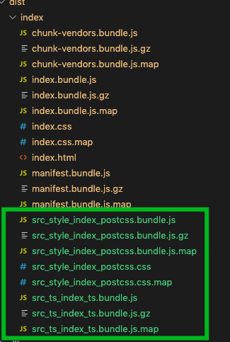

## 课时 14: 升级 webpack5

本章概要

- <a href="#14_1">webpack5 做了哪些事情？</a>
- <a href="#14_2">升级 webpack5</a>
- <a href="#14_3">编译速度对比</a>
- <a href="#14_4">项目对应的改变</a>

### <a name="14_1">webpack5 做了哪些事情？</a>

[webpack5 具体调整内容点这里](https://github.com/webpack/changelog-v5/blob/master/README.md)

`webpack5` 的大体优化方向

- 使用长期缓存提升编译速度
- 使用更好的算法和默认值来改善长期缓存
- 通过更好的 Tree Shaking 和 Code Generation 来改善 bundle 大小
- 清除处于怪异状态的内部结构，同时在 v4 中实现功能而不引入任何重大更改
- 通过引入重大更改来为将来的功能做准备，以使我们能够尽可能长时间地使用 v5

```bash
npm i webpack@5.0.0-beta.9 -D # 安装webpack5版本
```

### <a name="14_2">升级 webpack5</a>

本教程可以通过教授架一键升级

```bash
webpack-box upgrade 5
```

主要升级了两个插件

```json
{
  "html-webpack-plugin": "^4.0.0-beta.11",
  "webpack": "^5.0.0-beta.9"
}
```

### <a name="14_3">编译速度对比</a>

```bash
webpack-box build index
```

Version: webpack `4.41.2`

以下是使用了 `cache-loader`（不使用 `cache-loader` 大概在 3300ms 左右）

- 第一次 `4216ms`
- 第二次 `2781ms`
- 第三次 `2827ms`
- 第四次 `2797ms`

Version: webpack `5.0.0-beta.9`

- 第一次 `3567ms`
- 第二次 `2878ms`
- 第三次 `2907ms`
- 第四次 `2851ms`

可以看出来 `webpack5` 不使用 `cache-loader` 的情况下跟 `webpack4` 的编译速度基本差不多。所以以后终于不用再配置 cache-loader 了

### <a name="14_4">项目对应的改变</a>

#### cache-loader 不再需要

使用持久性缓存时，您不再需要缓存加载器。与 babel cacheDirectory 相同。

#### html-webpack-plugin 问题

`error`

1. Cannot add property htmlWebpackPluginAlterChunks, object is not extensible

安装 4.x 版本可修复

```bash
npm i html-webpack-plugin@4.0.0-beta.11
```

2. Cannot read property 'get' of undefined

`未修复` 第一次编译生效，保存之后会报错，`webpack5` 对热更新进行了重写，导致 `html-webpack-plugin` 不兼容，[原因可查](https://github.com/jantimon/html-webpack-plugin/issues/1129)

#### 动态加载的文件终于有名字了，不再是 id，而是改为项目路径的拼接



#### 反馈目录

- mini-css-extract-plugin is incompatible (RuntimeModules change)
- fork-ts-checker-webpack-plugin is incompatible (frozen hooks)
- circular-dependency-plugin is incompatible (dep.module removed)
- cache-loader is no longer needed
- webpack-cli misses Stats.presetToOptions (should use compilation.createStatsOptions)
- html-webpack-plugin misses fileTimestamps (should use fileSystemInfo)
- null prototype objects can't be serialized
- Deprecation warning for the HMR defaults
- Docs need update
- namedChunkGroups have weird keys
- MultiStats.toJson fails without options argument (#8561)
- Stats assetsByChunkName is different to v4
- node.global: false causes many errors
- define is missing require requirement for module
- reasons for scope-hoisted modules are inconsistent
- resolve.alias false doesn't work
- Source map caching is very slow
- Runtime modules duplicated in runtime chunk single
- Compilation.rebuildModule broken in alpha

现在已经全部修复了
